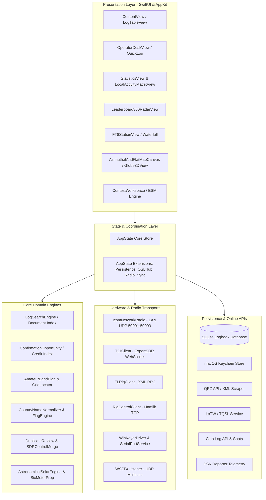

# YAAM (Yet Another ADIF Manager) - Comprehensive Developer & Architecture Guide

> **Target Audience:** Core maintainers, incoming developers, and amateur radio software engineers.  
> **Repository:** `ASIS.YAAM` / `fact0real/yaam`  
> **Platform:** macOS 15.0+ (Apple Silicon & Intel)  
> **Language & Frameworks:** Swift 6, SwiftUI, AppKit, SQLite3, Combine, CoreAudio, AVFoundation.  
> **Primary Transceivers Supported:** Icom IC-7300, IC-7300MK2, IC-705, IC-7610, IC-9700 (Network LAN UDP / USB CI-V), ExpertSDR/SunSDR (TCI), FLRig (XML-RPC), Hamlib (`rigctld`), and Serial CAT.

---

## 1. Executive Summary & Design Principles

YAAM is a professional-grade, native macOS amateur radio station management system and ADIF logbook engine. It unifies real-time radio telemetry, digital mode modems (native FT8), award credit tracking, contesting, and online synchronization into a responsive, low-latency desktop application.

### Key Architectural Tenets:
1. **Local-First & Data Integrity:**
   - All log operations are persisted to an ACID-compliant local SQLite database with write-ahead logging (WAL).
   - Atomic restore points and automated time-stamped backups prevent data corruption during external sync operations or abrupt power cuts.
2. **Zero-Latency UI Threading:**
   - Massive logbooks (100,000+ QSOs) must remain smooth at 60/120 fps.
   - Long operations (parsing, fuzzy duplicate matching, credit indices, solar propagation ray tracing) run in background queues (`DispatchQueue.global(qos: .userInitiated)`) or Swift concurrency actors, publishing immutable snapshots to the `@MainActor`.
3. **Strict Network Audio & Hardware Timing:**
   - Icom LAN and FT8 audio streams require sub-millisecond timer fidelity. RX audio pipelines are isolated from TX modulator pipelines to prevent buffer underrun/overrun and acoustic/RF feedback.
4. **Defensive Normalization:**
   - ADIF files from diverse sources (WSJT-X, N1MM, SmartSDR, QRZ, LoTW) frequently contain malformed country names, unnormalized bands, or inconsistent timestamps. YAAM canonicalizes records upon entry via `CountryNameNormalizer`, `AmateurBandPlan`, and `QSOIdentity`.

---

## 2. System Architecture & Layer Diagram



---

## 3. Directory Structure & Code Organization

The codebase is organized modularly under `YAAM/`:

| Subsystem / Group | Key Source Files | Primary Responsibility |
| :--- | :--- | :--- |
| **Core State** | `AppState.swift`, `AppStatePersistence.swift`, `AppStateQSLHub.swift`, `AppStateConnectivity.swift`, `AppStateRadioContestFeatures.swift`, `AppStateOperatorFeatures.swift`, `AppStateSyncCenter.swift`, `AppStateContestCalendar.swift` | Central application state, reactive pipelines, logbook arrays, and cross-window coordination. |
| **Logbook & Storage** | `LogbookDatabase.swift`, `ADIFParser.swift`, `LogFileReader.swift`, `LogExportEngine.swift`, `QSOIdentity.swift`, `KeychainStore.swift` | SQLite schema, transactional writes, streaming ADIF chunking, composite key deduplication, secure credential vault. |
| **Transceiver Hardware** | `IcomNetworkRadio.swift`, `TCIClient.swift`, `FLRigClient.swift`, `RigControlClient.swift`, `SerialPortService.swift`, `WinKeyerDriver.swift`, `RotatorService.swift` | Network and serial protocols, CI-V commands, LPCM16 audio streaming, PTT, frequency, and antenna rotator steering. |
| **Digital Modes** | `FT8EngineService.swift`, `FT8StationView.swift`, `WSJTXListener.swift` | Native FT8 modem integration (via `FT8808Engine`), waterfall FFT rendering, message sequencing, UDP listener. |
| **Analytics & Matrix** | `StatisticsView.swift`, `LocalActivityMatrixView.swift`, `LeaderboardView.swift`, `CompetitorTrackingEngine.swift`, `ConfirmationOpportunity.swift` | 24-hour local time activity matrix, 11-band 360° radar calculations, LoTW/QRZ credit opportunities, and daily confirmed pace. |
| **Contesting & ESM** | `ContestWorkspace.swift`, `ContestESMEngine.swift`, `ContestESMControlView.swift`, `RadioContestViews.swift`, `ContestCalendarService.swift` | Enter Sends Message (ESM) state machine, Cabrillo 3.0 export, serial generation, dupe checking, WA7BNM calendar. |
| **Propagation & Maps** | `AstronomicalSolarEngine.swift`, `SixMeterPropagationEngine.swift`, `SixMeterWatchView.swift`, `AzimuthalAndFlatMapCanvas.swift`, `Globe3DView.swift`, `DXAdvisorView.swift` | Solar zenith, sub-solar point, Great Circle azimuth/LP/SP, 6m sporadic-E detection, live greyline rendering. |
| **Cloud Integrations** | `QRZRankService.swift`, `QRZAwardsScraper.swift`, `ClubLogSpotsService.swift`, `EQSLService.swift`, `HamQTHUploadClient.swift`, `WavelogClient.swift`, `ON4KSTClient.swift` | REST, XML, and web-scraping integrations for cloud logging, cluster spots, and competitor rankings. |
| **Domain Normalization** | `CountryNameNormalizer.swift`, `CountryFlagEngine.swift`, `GridLocator.swift`, `OperatorModels.swift`, `DXCCDatabase.swift` | DXCC entity resolution, Unicode flag generation, Maidenhead grid conversions, band plans. |

---

## 4. Deep-Dive: Transceiver Network Protocol & CI-V Mechanics

### 4.1 Icom Network Radio Architecture (`IcomNetworkRadio.swift`)
The Icom Network Radio driver provides direct LAN connectivity to modern Icom transceivers without requiring physical USB cables.

- **Ports Used:**
  - `50001 UDP`: Control & Handshake (Authentication, keepalive, ping/pong, CI-V commands).
  - `50002 UDP`: Bidirectional Audio (48 kHz, 16-bit signed linear PCM, mono, 10ms frame intervals).
  - `50003 UDP`: Scope / FFT Spectrum Waterfall data.

### 4.2 Critical IC-7300MK2 vs IC-7300 Differences
During reverse-engineering of SDR-Control and hardware testing on the **IC-7300MK2**, major differences in CI-V memory addresses were discovered. The MK2 introduced new registers due to the integrated LAN interface:

```
+--------------------------+-----------------------+-----------------------+
| Setting Parameter        | Legacy IC-7300        | IC-7300MK2 (Exact)    |
+--------------------------+-----------------------+-----------------------+
| DATA MOD Input Select    | 1A 05 00 67 (USB/MIC) | 1A 05 00 85 (LAN/USB) |
|   -> LAN Value           | N/A (Not supported)   | 05 (LAN)              |
|   -> USB Value           | 02 (USB)              | 03 (USB)              |
|   -> MIC Value           | 01 (MIC)              | 00 (MIC)              |
| DATA OFF MOD Input       | 1A 05 00 66           | 1A 05 00 84           |
| LAN MOD Input Level      | N/A                   | 1A 05 00 83 01 28(50%)|
| USB MOD Input Level      | 1A 05 00 68           | 1A 05 00 81 01 28(50%)|
| AF Output Select         | 1A 05 00 70           | 1A 05 00 89 01 (AF)   |
+--------------------------+-----------------------+-----------------------+
```

> [!CAUTION]
> **RF Feedback / Volatility Prevention:**  
> If `DATA MOD` is not switched to `LAN` (`1A 05 00 85 05`), the radio defaults to `MIC`. When transmitting FT8 over network audio, the transmitter will modulate desk microphone ambient audio, causing extreme RF feedback and severe power volatility (ALC hunting). Never revert this sub-command.

### 4.3 Audio Timing & TX Jitter Prevention
In `IcomNetworkRadio.swift`:
1. **RX Muting during TX:** When `isTransmitActive` is true, incoming RX audio packets in `receiveAudioPayload` are dropped. This prevents the network dispatch queue from starving the transmit timer.
2. **Smooth Buffer Pre-Priming:** The first 8 frames of audio are transmitted with a 1.0 ms micro-delay before engaging the steady 10.0 ms nanosecond hardware timer.
3. **Trailing Audio Tail:** An audio tail buffer (160 ms silence) is flushed before releasing PTT, ensuring trailing FT8 symbols are never clipped.

---

## 5. Logbook Storage & Deduplication Engine

### 5.1 SQLite Schema & Concurrency (`LogbookDatabase.swift`)
The internal SQLite database uses Write-Ahead Logging (`PRAGMA journal_mode=WAL;`) and synchronized normal mode (`PRAGMA synchronous=NORMAL;`).

Key Tables:
- `qsos`: Primary logbook records indexed on `qso_date`, `time_on`, `call`, `band`, `mode`, and `unique_key`.
- `qsl_upload_queue`: Durable queue for asynchronous cloud uploads with retry counters and exponential backoff.
- `restore_points`: Snapshots of log states prior to bulk merges or cloud syncs.

### 5.2 Composite Unique Key (`QSOIdentity.swift`)
To prevent duplicate records while supporting multiple QSOs with the same station on different bands/modes:
$$\text{UniqueKey} = \text{CALL} \parallel \text{QSO\_DATE} \parallel \text{NORMALIZED\_TIME\_4DIGIT} \parallel \text{BAND} \parallel \text{MODE}$$
- Time is normalized to 4-digit UTC (`HHmm`), absorbing 1–2 minute logging discrepancies from logging software.

---

## 6. Analytics, Statistics, & The 11 Amateur Bands

### 6.1 The 11 Amateur Bands Standard
In accordance with international amateur radio allocations and user specifications, YAAM defines the **11 core HF/VHF amateur bands**:
$$\{ 160\text{m}, 80\text{m}, 60\text{m}, 40\text{m}, 30\text{m}, 20\text{m}, 17\text{m}, 15\text{m}, 12\text{m}, 10\text{m}, 6\text{m} \}$$

### 6.2 360° Radar Performance Calculations (`LeaderboardView.swift`)
The 360° Radar Gauge computes percentile tiers against global active operators:
- **Band Potential:** $11 \text{ bands} \times 340 \text{ active DXCC entities} = \mathbf{3,740} \text{ total Band-Countries}$.
- **DXCC Potential:** $340 \text{ active entities}$.
- **Daily Performance Card:** Evaluates `DailyConfirmedPerformance`. Instead of reporting 0 for days without active sessions, it computes the **average confirmed QSOs per active day** ($82.5$ confirmed/day for sample log) and displays a 6-day sparkline bar visualizer of recent confirmed contacts.

### 6.3 24-Hour Local Activity Matrix (`LocalActivityMatrixView.swift`)
Converts UTC `(QSO_DATE, TIME_ON)` into the operator's current local timezone (`TimeZone.current`):
- **3 Dynamic Views:**
  1. `Day vs Hour`: $7 \times 24$ heatmap matrix (Saturday through Friday).
  2. `Band vs Hour`: $11 \text{ bands} \times 24 \text{ hours}$ heatmap matrix.
  3. `Day vs Band`: $7 \text{ days} \times 11 \text{ bands}$ heatmap matrix.
- **Diurnal Solar Indicators:** Classifies hours into Dawn (🌅), Day (☀️), Dusk (🌇), and Night (🌙).
- **Deep-Dive Inspector:** Ranks countries worked in any selected time-slot with national flags, confirmation percentages, and one-click log location.

---

## 7. Enter-Sends-Message (ESM) Contest Engine

The ESM state machine (`ContestESMEngine.swift`) streamlines high-rate CW and digital contesting:
- **Running State:**
  - `CQ` $\rightarrow$ Wait for caller $\rightarrow$ Send Report $\rightarrow$ Wait for acknowledgment $\rightarrow$ Send `TU 73` + Log QSO $\rightarrow$ Return to `CQ`.
- **Search & Pounce (S&P) State:**
  - Tune $\rightarrow$ Send Callsign $\rightarrow$ Wait for report $\rightarrow$ Send Exchange Report $\rightarrow$ Receive confirmation $\rightarrow$ Log QSO.

---

## 8. Development & Build Verification Guide

### 8.1 Building the Project
Always specify the full developer directory to ensure macOS SDK compatibility:
```bash
DEVELOPER_DIR=/Applications/Xcode.app/Contents/Developer xcodebuild -scheme YAAM -destination 'platform=macOS' build
```

### 8.2 Running Unit & Regression Tests
YAAM includes 21 dedicated test suites in `Tests/`:
```bash
DEVELOPER_DIR=/Applications/Xcode.app/Contents/Developer xcodebuild -scheme YAAM -destination 'platform=macOS' test
```

### 8.3 Key Regression Suites to Check Before Commits:
- `QSOIdentityRegression.swift`: Ensures deduplication keys never regress.
- `ConfirmationSyncRegression.swift`: Verifies LoTW and QRZ record merging.
- `CountryFlagLookupRegression.swift`: Validates country canonicalization and emoji flag generation.
- `FT8StationEngineRegression.swift`: Tests FT8 audio framing and sequencer state transitions.

---

## 9. Guidelines for Future Contributors

1. **Keep UI Thread Fast:** Never perform string processing or date formatting of the entire logbook on `@MainActor`. Use background threads and batch update `@Published` variables.
2. **Preserve Radio Safety:** When adding CI-V commands, verify whether the target radio supports them in data mode (`DATA MOD`). Ensure that radio disconnect handlers cleanly restore original user settings.
3. **Respect Timezone Semantics:**
   - All logbook storage and ADIF exchanges **MUST** remain in strict **UTC**.
   - Local time conversions (`TimeZone.current`) are strictly for presentation layer views (such as `LocalActivityMatrixView` and `ClubLogSpotsView`).
