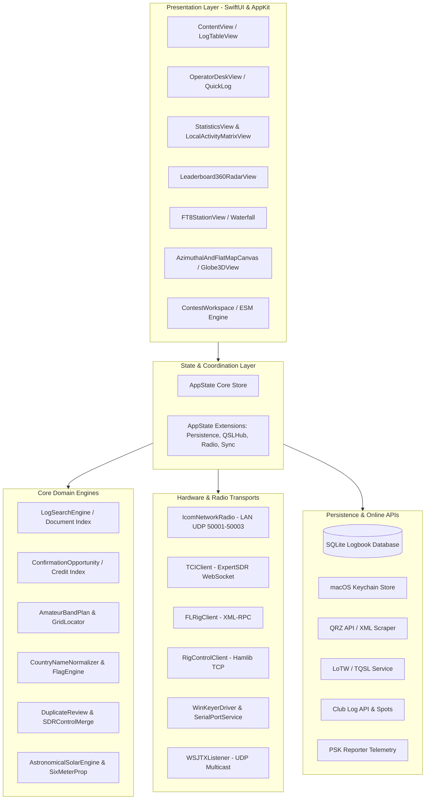

# YAAM (Yet Another ADIF Manager) - Comprehensive Developer & Architecture Guide

> **Target Audience:** Core maintainers, incoming developers, and amateur radio software engineers.  
> **Repository:** `ASIS.YAAM` / `fact0real/yaam`  
> **Platform:** macOS 15.0+ (Apple Silicon & Intel)  
> **Language & Frameworks:** Swift 6, SwiftUI, AppKit, SQLite3, Combine, CoreAudio, AVFoundation.  
> **Primary Transceivers Supported:** Icom IC-7300, IC-7300MK2, IC-705, IC-7610, IC-9700 (Network LAN UDP / USB CI-V), ExpertSDR/SunSDR (TCI), FLRig (XML-RPC), Hamlib (`rigctld`), and Serial CAT.

---

## 1. Executive Summary & Design Principles

YAAM is a professional-grade, native macOS amateur radio station management system and ADIF logbook engine. It unifies real-time radio telemetry, digital mode modems (native FT8), award credit tracking, contesting, and online synchronization into a responsive, low-latency desktop application.

### Key Architectural Tenets:
1. **Local-First & Data Integrity:**
   - All log operations are persisted to an ACID-compliant local SQLite database with write-ahead logging (WAL).
   - Atomic restore points and automated time-stamped backups prevent data corruption during external sync operations or abrupt power cuts.
2. **Zero-Latency UI Threading:**
   - Massive logbooks (100,000+ QSOs) must remain smooth at 60/120 fps.
   - Long operations (parsing, fuzzy duplicate matching, credit indices, solar propagation ray tracing) run in background queues (`DispatchQueue.global(qos: .userInitiated)`) or Swift concurrency actors, publishing immutable snapshots to the `@MainActor`.
3. **Strict Network Audio & Hardware Timing:**
   - Icom LAN and FT8 audio streams require sub-millisecond timer fidelity. RX audio pipelines are isolated from TX modulator pipelines to prevent buffer underrun/overrun and acoustic/RF feedback.
4. **Defensive Normalization:**
   - ADIF files from diverse sources (WSJT-X, N1MM, SmartSDR, QRZ, LoTW) frequently contain malformed country names, unnormalized bands, or inconsistent timestamps. YAAM canonicalizes records upon entry via `CountryNameNormalizer`, `AmateurBandPlan`, and `QSOIdentity`.

---

## 2. System Architecture & Layer Diagram


```mermaid
graph TD
    subgraph UI_Layer [Presentation Layer - SwiftUI & AppKit]
        MainView[ContentView / LogTableView]
        OpDesk[OperatorDeskView / QuickLog]
        StatsView[StatisticsView & LocalActivityMatrixView]
        RadarView[Leaderboard360RadarView]
        FT8View[FT8StationView / Waterfall]
        MapViews[AzimuthalAndFlatMapCanvas / Globe3DView]
        ContestView[ContestWorkspace / ESM Engine]
    end

    subgraph State_Coordination [State & Coordination Layer]
        AppState[AppState Core Store]
        AppStateExt[AppState Extensions: Persistence, QSLHub, Radio, Sync]
    end

    subgraph Engine_Layer [Core Domain Engines]
        LogSearch[LogSearchEngine / Document Index]
        CreditEngine[ConfirmationOpportunity / Credit Index]
        BandPlan[AmateurBandPlan & GridLocator]
        NormEngine[CountryNameNormalizer & FlagEngine]
        DupeEngine[DuplicateReview & SDRControlMerge]
        SolarEngine[AstronomicalSolarEngine & SixMeterProp]
    end

    subgraph Hardware_Network [Hardware & Radio Transports]
        IcomNet[IcomNetworkRadio - LAN UDP 50001-50003]
        TCI[TCIClient - ExpertSDR WebSocket]
        FLRig[FLRigClient - XML-RPC]
        Rigctld[RigControlClient - Hamlib TCP]
        WinKeyer[WinKeyerDriver & SerialPortService]
        WSJTX[WSJTXListener - UDP Multicast]
    end

    subgraph Storage_Cloud [Persistence & Online APIs]
        SQLite[(SQLite Logbook Database)]
        Keychain[macOS Keychain Store]
        QRZ[QRZ API / XML Scraper]
        LoTW[LoTW / TQSL Service]
        ClubLog[Club Log API & Spots]
        PSKRep[PSK Reporter Telemetry]
    end

    UI_Layer --> State_Coordination
    State_Coordination --> Engine_Layer
    State_Coordination --> Hardware_Network
    State_Coordination --> Storage_Cloud
```

---

## 3. Directory Structure & Code Organization

The codebase is organized modularly under `YAAM/`:

| Subsystem / Group | Key Source Files | Primary Responsibility |
| :--- | :--- | :--- |
| **Core State** | `AppState.swift`, `AppStatePersistence.swift`, `AppStateQSLHub.swift`, `AppStateConnectivity.swift`, `AppStateRadioContestFeatures.swift`, `AppStateOperatorFeatures.swift`, `AppStateSyncCenter.swift`, `AppStateContestCalendar.swift` | Central application state, reactive pipelines, logbook arrays, and cross-window coordination. |
| **Logbook & Storage** | `LogbookDatabase.swift`, `ADIFParser.swift`, `LogFileReader.swift`, `LogExportEngine.swift`, `QSOIdentity.swift`, `KeychainStore.swift` | SQLite schema, transactional writes, streaming ADIF chunking, composite key deduplication, secure credential vault. |
| **Transceiver Hardware** | `IcomNetworkRadio.swift`, `TCIClient.swift`, `FLRigClient.swift`, `RigControlClient.swift`, `SerialPortService.swift`, `WinKeyerDriver.swift`, `RotatorService.swift` | Network and serial protocols, CI-V commands, LPCM16 audio streaming, PTT, frequency, and antenna rotator steering. |
| **Digital Modes** | `FT8EngineService.swift`, `FT8StationView.swift`, `WSJTXListener.swift` | Native FT8 modem integration (via `FT8808Engine`), waterfall FFT rendering, message sequencing, UDP listener. |
| **Analytics & Matrix** | `StatisticsView.swift`, `LocalActivityMatrixView.swift`, `LeaderboardView.swift`, `CompetitorTrackingEngine.swift`, `ConfirmationOpportunity.swift` | 24-hour local time activity matrix, 11-band 360° radar calculations, LoTW/QRZ credit opportunities, and daily confirmed pace. |
| **Contesting & ESM** | `ContestWorkspace.swift`, `ContestESMEngine.swift`, `ContestESMControlView.swift`, `RadioContestViews.swift`, `ContestCalendarService.swift` | Enter Sends Message (ESM) state machine, Cabrillo 3.0 export, serial generation, dupe checking, WA7BNM calendar. |
| **Propagation & Maps** | `AstronomicalSolarEngine.swift`, `SixMeterPropagationEngine.swift`, `SixMeterWatchView.swift`, `AzimuthalAndFlatMapCanvas.swift`, `Globe3DView.swift`, `DXAdvisorView.swift` | Solar zenith, sub-solar point, Great Circle azimuth/LP/SP, 6m sporadic-E detection, live greyline rendering. |
| **Cloud Integrations** | `QRZRankService.swift`, `QRZAwardsScraper.swift`, `ClubLogSpotsService.swift`, `EQSLService.swift`, `HamQTHUploadClient.swift`, `WavelogClient.swift`, `ON4KSTClient.swift` | REST, XML, and web-scraping integrations for cloud logging, cluster spots, and competitor rankings. |
| **Domain Normalization** | `CountryNameNormalizer.swift`, `CountryFlagEngine.swift`, `GridLocator.swift`, `OperatorModels.swift`, `DXCCDatabase.swift` | DXCC entity resolution, Unicode flag generation, Maidenhead grid conversions, band plans. |

---

## 4. Deep-Dive: Transceiver Network Protocol & CI-V Mechanics

### 4.1 Icom Network Radio Architecture (`IcomNetworkRadio.swift`)
The Icom Network Radio driver provides direct LAN connectivity to modern Icom transceivers without requiring physical USB cables.

- **Ports Used:**
  - `50001 UDP`: Control & Handshake (Authentication, keepalive, ping/pong, CI-V commands).
  - `50002 UDP`: Bidirectional Audio (48 kHz, 16-bit signed linear PCM, mono, 10ms frame intervals).
  - `50003 UDP`: Scope / FFT Spectrum Waterfall data.

### 4.2 Critical IC-7300MK2 vs IC-7300 Differences
During reverse-engineering of SDR-Control and hardware testing on the **IC-7300MK2**, major differences in CI-V memory addresses were discovered. The MK2 introduced new registers due to the integrated LAN interface:

```
+--------------------------+-----------------------+-----------------------+
| Setting Parameter        | Legacy IC-7300        | IC-7300MK2 (Exact)    |
+--------------------------+-----------------------+-----------------------+
| DATA MOD Input Select    | 1A 05 00 67 (USB/MIC) | 1A 05 00 85 (LAN/USB) |
|   -> LAN Value           | N/A (Not supported)   | 05 (LAN)              |
|   -> USB Value           | 02 (USB)              | 03 (USB)              |
|   -> MIC Value           | 01 (MIC)              | 00 (MIC)              |
| DATA OFF MOD Input       | 1A 05 00 66           | 1A 05 00 84           |
| LAN MOD Input Level      | N/A                   | 1A 05 00 83 01 28(50%)|
| USB MOD Input Level      | 1A 05 00 68           | 1A 05 00 81 01 28(50%)|
| AF Output Select         | 1A 05 00 70           | 1A 05 00 89 01 (AF)   |
+--------------------------+-----------------------+-----------------------+
```

> [!CAUTION]
> **RF Feedback / Volatility Prevention:**  
> If `DATA MOD` is not switched to `LAN` (`1A 05 00 85 05`), the radio defaults to `MIC`. When transmitting FT8 over network audio, the transmitter will modulate desk microphone ambient audio, causing extreme RF feedback and severe power volatility (ALC hunting). Never revert this sub-command.

### 4.3 Audio Timing & TX Jitter Prevention
In `IcomNetworkRadio.swift`:
1. **RX Muting during TX:** When `isTransmitActive` is true, incoming RX audio packets in `receiveAudioPayload` are dropped. This prevents the network dispatch queue from starving the transmit timer.
2. **Smooth Buffer Pre-Priming:** The first 8 frames of audio are transmitted with a 1.0 ms micro-delay before engaging the steady 10.0 ms nanosecond hardware timer.
3. **Trailing Audio Tail:** An audio tail buffer (160 ms silence) is flushed before releasing PTT, ensuring trailing FT8 symbols are never clipped.

---

## 5. Logbook Storage & Deduplication Engine

### 5.1 SQLite Schema & Concurrency (`LogbookDatabase.swift`)
The internal SQLite database uses Write-Ahead Logging (`PRAGMA journal_mode=WAL;`) and synchronized normal mode (`PRAGMA synchronous=NORMAL;`).

Key Tables:
- `qsos`: Primary logbook records indexed on `qso_date`, `time_on`, `call`, `band`, `mode`, and `unique_key`.
- `qsl_upload_queue`: Durable queue for asynchronous cloud uploads with retry counters and exponential backoff.
- `restore_points`: Snapshots of log states prior to bulk merges or cloud syncs.

### 5.2 Composite Unique Key (`QSOIdentity.swift`)
To prevent duplicate records while supporting multiple QSOs with the same station on different bands/modes:
$$\text{UniqueKey} = \text{CALL} \parallel \text{QSO\_DATE} \parallel \text{NORMALIZED\_TIME\_4DIGIT} \parallel \text{BAND} \parallel \text{MODE}$$
- Time is normalized to 4-digit UTC (`HHmm`), absorbing 1–2 minute logging discrepancies from logging software.

---

## 6. Analytics, Statistics, & The 11 Amateur Bands

### 6.1 The 11 Amateur Bands Standard
In accordance with international amateur radio allocations and user specifications, YAAM defines the **11 core HF/VHF amateur bands**:
$$\{ 160\text{m}, 80\text{m}, 60\text{m}, 40\text{m}, 30\text{m}, 20\text{m}, 17\text{m}, 15\text{m}, 12\text{m}, 10\text{m}, 6\text{m} \}$$

### 6.2 360° Radar Performance Calculations (`LeaderboardView.swift`)
The 360° Radar Gauge computes percentile tiers against global active operators:
- **Band Potential:** $11 \text{ bands} \times 340 \text{ active DXCC entities} = \mathbf{3,740} \text{ total Band-Countries}$.
- **DXCC Potential:** $340 \text{ active entities}$.
- **Daily Performance Card:** Evaluates `DailyConfirmedPerformance`. Instead of reporting 0 for days without active sessions, it computes the **average confirmed QSOs per active day** ($82.5$ confirmed/day for sample log) and displays a 6-day sparkline bar visualizer of recent confirmed contacts.

### 6.3 24-Hour Local Activity Matrix (`LocalActivityMatrixView.swift`)
Converts UTC `(QSO_DATE, TIME_ON)` into the operator's current local timezone (`TimeZone.current`):
- **3 Dynamic Views:**
  1. `Day vs Hour`: $7 \times 24$ heatmap matrix (Saturday through Friday).
  2. `Band vs Hour`: $11 \text{ bands} \times 24 \text{ hours}$ heatmap matrix.
  3. `Day vs Band`: $7 \text{ days} \times 11 \text{ bands}$ heatmap matrix.
- **Diurnal Solar Indicators:** Classifies hours into Dawn (🌅), Day (☀️), Dusk (🌇), and Night (🌙).
- **Deep-Dive Inspector:** Ranks countries worked in any selected time-slot with national flags, confirmation percentages, and one-click log location.

---

## 7. Enter-Sends-Message (ESM) Contest Engine

The ESM state machine (`ContestESMEngine.swift`) streamlines high-rate CW and digital contesting:
- **Running State:**
  - `CQ` $\rightarrow$ Wait for caller $\rightarrow$ Send Report $\rightarrow$ Wait for acknowledgment $\rightarrow$ Send `TU 73` + Log QSO $\rightarrow$ Return to `CQ`.
- **Search & Pounce (S&P) State:**
  - Tune $\rightarrow$ Send Callsign $\rightarrow$ Wait for report $\rightarrow$ Send Exchange Report $\rightarrow$ Receive confirmation $\rightarrow$ Log QSO.

---

## 8. Development & Build Verification Guide

### 8.1 Building the Project
Always specify the full developer directory to ensure macOS SDK compatibility:
```bash
DEVELOPER_DIR=/Applications/Xcode.app/Contents/Developer xcodebuild -scheme YAAM -destination 'platform=macOS' build
```

### 8.2 Running Unit & Regression Tests
YAAM includes 21 dedicated test suites in `Tests/`:
```bash
DEVELOPER_DIR=/Applications/Xcode.app/Contents/Developer xcodebuild -scheme YAAM -destination 'platform=macOS' test
```

### 8.3 Key Regression Suites to Check Before Commits:
- `QSOIdentityRegression.swift`: Ensures deduplication keys never regress.
- `ConfirmationSyncRegression.swift`: Verifies LoTW and QRZ record merging.
- `CountryFlagLookupRegression.swift`: Validates country canonicalization and emoji flag generation.
- `FT8StationEngineRegression.swift`: Tests FT8 audio framing and sequencer state transitions.

---

## 9. Guidelines for Future Contributors

1. **Keep UI Thread Fast:** Never perform string processing or date formatting of the entire logbook on `@MainActor`. Use background threads and batch update `@Published` variables.
2. **Preserve Radio Safety:** When adding CI-V commands, verify whether the target radio supports them in data mode (`DATA MOD`). Ensure that radio disconnect handlers cleanly restore original user settings.
3. **Respect Timezone Semantics:**
   - All logbook storage and ADIF exchanges **MUST** remain in strict **UTC**.
   - Local time conversions (`TimeZone.current`) are strictly for presentation layer views (such as `LocalActivityMatrixView` and `ClubLogSpotsView`).

---

## 10. DX News, Weekly Bulletins & Feedback Subsystem

### 10.1 DX-World & 425 DX News Intelligence Pipeline (`DXpeditionService.swift`)
YAAM unifies multi-source weekly DX intelligence into structured, rich domain models (`DXpeditionEntry`, `DXNewsArticle`, `DXBulletin`):
- **425 DX News:**
  - Ingests weekly HTML calendar (`wcal.php`) and official weekly bulletins (`wbull.php` plain-text and `wbullpdf.php` PDF).
  - Normalizes announcement windows, extracts Maidenhead grid locators (`extractGrid`), IOTA island tags (`extractIOTA`), operating modes (FT8, CW, SSB), bands (160m–6m), QSL managers (`extractQSLInfo`), and team operators (`extractOperators`).
- **DX-World:**
  - Parses official RSS feed (`/category/dx-news/feed/`) without discarding free-form titles via `DXCCDatabase.resolve(callsign:)`.
  - Downloads linked weekly PDF bulletins (`dx-world-weekly-bulletin-NNN`), extracting multi-operator teams and operating periods across international date formats.
- **Deduplication & Union:**
  - `merge(_:)` combines matching operations across sources while unioning bands, modes, and operators without data loss.
  - Cached locally in `UserDefaults` under `dxpeditionCache.v2` for offline resilience.

### 10.2 DX News & Intelligence Desk (`DXNewsAndIntelligenceView.swift`)
Located in Operator Desk (Desk Tab 21, shortcut `Cmd+Shift+N`):
1. **DXpeditions Intelligence:** Live cluster spot cross-referencing, filter chips (Active Now, Upcoming, ATNO/Needed, Digital FT8, 6m, IOTA), and one-click rig QSY.
2. **Live DX News Feed:** Full-text searchable cards with category tagging and an in-app article reader sheet.
3. **Weekly Bulletins Reader:** Full-text viewer for DX-World and 425 issues with in-text search, copy to clipboard, and direct web links.

### 10.3 Instant Feedback & Community Engine (`FeedbackView.swift`)
Accessible from anywhere in the application (`Cmd+Shift+F`, Help menu, About dialog, and HelpView banner):
- **Categories:** Feature Requests, Bug Reports, DX Data Suggestions, and General feedback.
- **Triage & Metadata:** Priority selector, optional operator callsign and email, and an optional non-sensitive environment diagnostics snapshot (macOS version, YAAM build, active station, hardware bridge statuses).
- **Submission Channels:** Direct `mailto:` email composer, GitHub Issue URL builder with prepopulated markdown labels, and Clipboard copy.
- **Local Audit History:** Preserves submitted feedback in `UserDefaults` (`savedFeedbackHistory_v1`) so operators can track past suggestions.

---

## 11. Network-Attached Transceiver Emulator (NTE) Architecture

### 11.1 Subsystem Design Overview
The Network-Attached Transceiver Emulator (`NetworkTransceiverEmulatorEngine.swift`) provides a full hardware-level emulation platform for network RF transceivers. It consists of three decoupled layers:

1. **Network & Protocol Server Layer (`IcomNetworkServer.swift`, `HamlibRigctldServer.swift`):**
   - **Control Socket (UDP 50001):** Implements discovery probe (`0x03` -> `0x04`), login authentication (128-byte login, 96-byte token reply), capability discovery (66+N*102 bytes), stream negotiation (144-byte stream request, 80-byte stream reply), keepalives (`0x00`), and timestamp pings (`0x07`).
   - **CI-V Socket (UDP 50002):** Implements `0x01C0` channel open, `0xC1` framing, and translates CI-V commands (`0x03` frequency query, `0x05` frequency set, `0x04` mode query, `0x06` mode set, `0x1C` PTT toggle, and `0x15` meter queries for S-meter, Po, SWR, and ALC).
   - **Audio Socket (UDP 50003):** High-precision `DispatchSourceTimer` (strict 10 ms interval) streams 48 kHz LPCM16 audio frames (480 samples = 960 bytes per packet) with sequence tracking. Receives client TX audio frames when PTT is active and computes real-time RMS power and ALC modulation.
   - **Hamlib rigctld Server (TCP 4532):** Non-blocking BSD TCP socket server implementing Hamlib command set (`f`, `F`, `m`, `M`, `t`, `T`, `l`, `\dump_state`) for direct connection by WSJT-X, JTDX, and third-party loggers.

2. **Synthetic RF & Channel Simulation Engine (`SyntheticRFSignalEngine.swift`):**
   - **Digital Mode Signal Synthesizer:** Real-time continuous-phase frequency-shift keying (CPFSK) using `FT8Codec` for 79-tone FT8 and 4-GFSK for FT4 aligned with UTC 15-second / 7.5-second time slots.
   - **Morse Code Beacon:** Raised-cosine envelope generator with 5 ms smoothing to eliminate key clicks.
   - **Multi-Station Pileup Generator:** Generates up to 8 simultaneous synthetic callers on distinct audio offsets with varying SNR.
   - **Channel Physics / Impairments:**
     - **AWGN:** Box-Muller transform calibrated to exact SNR (-30 dB to +30 dB in 2.5 kHz bandwidth).
     - **Fading:** Low-pass filtered complex Gaussian process implementing Rayleigh and Rician fading models with adjustable Doppler spread (0.1 Hz to 5.0 Hz).
     - **Doppler:** Continuous phase accumulator supporting static Doppler shift (±500 Hz) and dynamic frequency drift (±100 Hz/min).
     - **Atmospheric QRN:** Poisson-distributed static burst generator.
     - **Network Impairments:** Injectable UDP packet loss and jitter buffer delay.
   - **Spectral Analysis:** Real-time Accelerate `vDSP_DFT` computing 512-point FFT magnitudes for live waterfall visualization.

3. **Automated DSP Benchmarking & QA (`NetworkTransceiverAutomatedTester.swift`):**
   - Implements automated SNR sensitivity sweeps from +6 dB down to -24 dB in 3 dB steps.
   - Tests synthetic audio through `FT8Codec.decode` and calculates sensitivity floor and success percentages.
   - Produces structured markdown and JSON benchmark reports.

4. **User Interface (`NetworkTransceiverEmulatorView.swift`):**
   - Front panel OLED display with glowing digital VFO, band badges, dynamic analog S/Po/SWR meter, and tuning controls.
   - Real-time Canvas-based audio spectrum visualizer.
   - Protocol activity terminal console with category filtering.
   - Accessible via Operator Desk (Tab 24), Tools menu (`Cmd+Option+E`), or standalone window scene (`YAAMWindowID.transceiverEmulator`).

---

## 12. Multi-Rig FT8 Cluster & SO2R/SO3R Architecture

### 12.1 Subsystem Topology & Multi-Instance Engine Design (`MultiRigFT8Hub.swift`, `FT8EngineService.swift`)
The Multi-Rig FT8 Cluster subsystem orchestrates up to 4 concurrent, physically isolated transceivers. Rather than sharing a single audio pipeline or multiplexing CAT sessions sequentially, YAAM deploys fully autonomous DSP and control stacks:

1. **Autonomous Slot Containers (`MultiRigSlot`):**
   - Each slot owns an isolated instance of `FT8EngineService` executing on dedicated Grand Central Dispatch queues.
   - Separate audio processing: Each engine binds to an explicit CoreAudio hardware UID (e.g. `USB Audio CODEC`, `BlackHole 2ch`, or internal network audio stream from `IcomNetworkRadio`).
   - Separate CAT driver layer: Supported drivers include Icom LAN UDP (direct raw socket), Hamlib `rigctld` (TCP socket), Lab599 Discovery TX-500 (USB serial), Xiegu X6100 (USB-C CI-V), Icom USB, and Internal Network-Attached Transceiver Emulator.
2. **State Synchronization & Persistence (`MultiRigFT8Hub`):**
   - MainActor-isolated orchestrator managing slot lifecycle, layout preferences, and hardware configuration persistence via `UserDefaults` keys `multiRigFT8.slots.v2`, `multiRigFT8.layout.v2`, and `multiRigFT8.interlock.v2`.
   - Defaults to an active 3-slot SO3R profile:
     - **Slot 1:** 20m (14.074 MHz) on Icom LAN UDP (`192.168.1.150`).
     - **Slot 2:** 40m (7.074 MHz) on Lab599 Discovery TX-500 (USB serial).
     - **Slot 3:** 10m (28.074 MHz) on Transceiver Emulator / rigctld (`127.0.0.1:4532`).

### 12.2 Cross-Rig Hardware Interlock Coordinator (`MultiRigInterlockCoordinator`)
Simultaneous transmission across collocated antennas introduces severe risks of receiver desensitization or RF front-end damage. The `MultiRigInterlockCoordinator` acts as an arbitrated hardware gate between DSP engines and physical PTT keying:

- **Interlock Policies (`MultiRigInterlockPolicy`):**
  - `.concurrent`: Unrestricted concurrent transmission across all armed slots (designed for stations with high-isolation bandpass filters or separate antenna towers).
  - `.strictLockout`: Hardware mutex policy. Only one transceiver may assert PTT at any instant. If Rig 1 is transmitting, Rig 2 is held in standby until Rig 1 releases PTT.
  - `.alternatingSlots` (SO2R Standard): Time-synchronized alternating slots based on the 15-second FT8 epoch:
    - Even slots (`:00`, `:30`): Primary Slot (Rig 1) transmits; secondary slots remain in receive.
    - Odd slots (`:15`, `:45`): Secondary Slot (Rig 2) transmits; Rig 1 remains in receive.
- **Emergency Circuit (`disarmAllTransmit`):** Instantaneously disarms transmit flags and de-asserts PTT across all active radio drivers simultaneously.

### 12.3 Cross-Band DX Opportunity Radar
Decoded message streams from all active slots are continuously fed into an aggregated opportunity evaluation pipeline:
- Decodes are filtered for `CQ` announcements and analyzed against the central station database.
- Opportunity badges are computed in real time: `NEW DXCC`, `NEW BAND`, `NEW GRID`, or `CALLING ME`.
- **1-Click Cross-Band Dispatch (`answerOpportunity`):** Automatically selects the corresponding transceiver slot, locks the FT8 audio offset frequency, formats the response message (e.g. `JA1ABC EP2AES LL45`), and arms transmission for the subsequent slot.

### 12.4 Unified Database Transaction & Log Concurrency
- `FT8EngineService` completion callbacks trigger `AppState.logMultiRigQSO(slot:qso:)`.
- Dispatched safely onto `@MainActor` to prevent SQLite write lock contention.
- Enriches ADIF records with `RADIO` metadata tags (e.g. `Rig 1 (20m FT8)`) and persists frequencies directly to `LogbookDatabase`.
- Updates global worked/confirmed tables so other active slots immediately recognize newly worked entities.

### 12.5 Presentation Layer & Window Topology (`MultiRigFT8View.swift`)
- **Responsive Layout Engine (`MultiRigLayoutMode`):**
  - `tripleColumn`: 3 parallel columns with independent waterfalls and decoders.
  - `heroAndSub`: High-resolution hero waterfall above dual compact sub-rig cards.
  - `dualSplit`: 50/50 vertical split for classic SO2R workflows.
  - `quadGrid`: 2x2 grid for 4-transceiver monitoring.
  - `focusedSingle`: Single active slot focus with hot-switch tab bar.
- **Standalone Window Topology:** Available in main window Operator Desk workspace and as a dedicated secondary window scene (`YAAMWindowID.multiRigFT8`) via shortcut `Cmd + Option + 8`.
