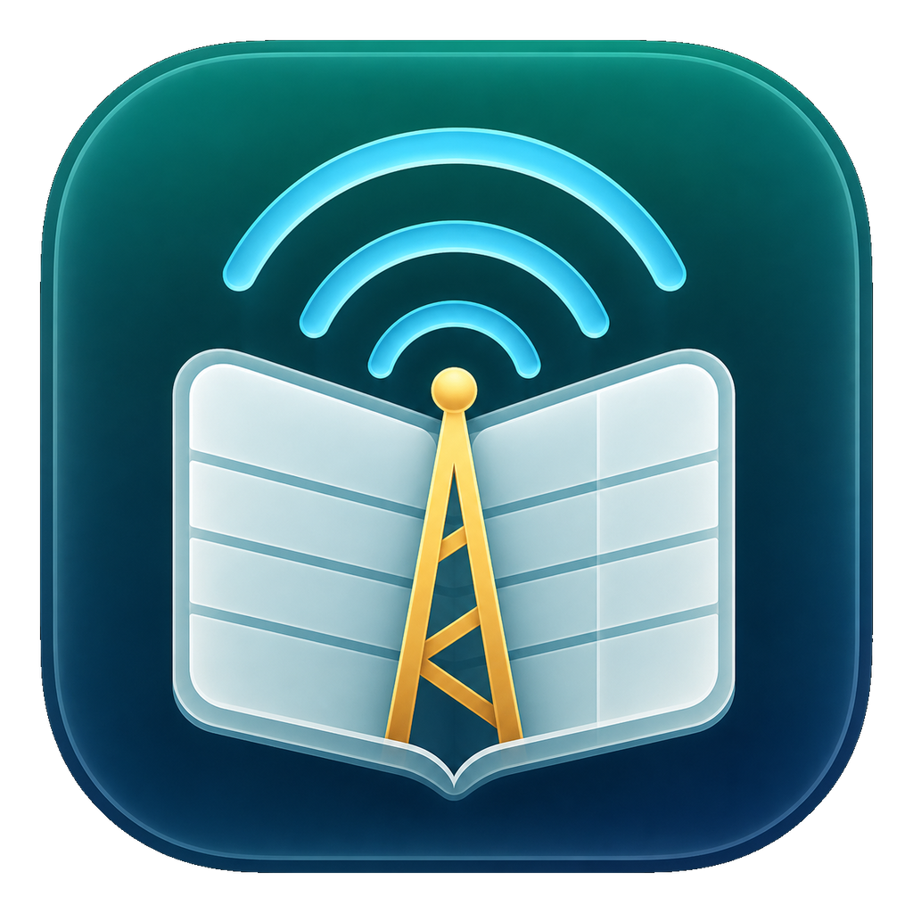
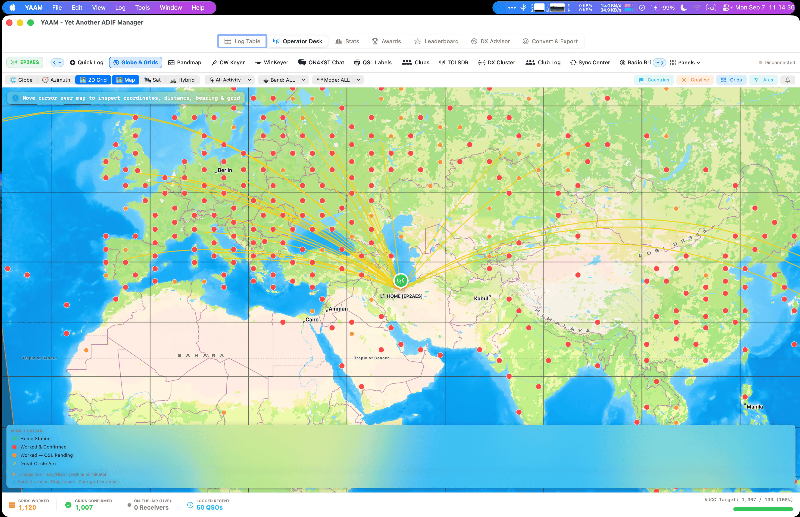
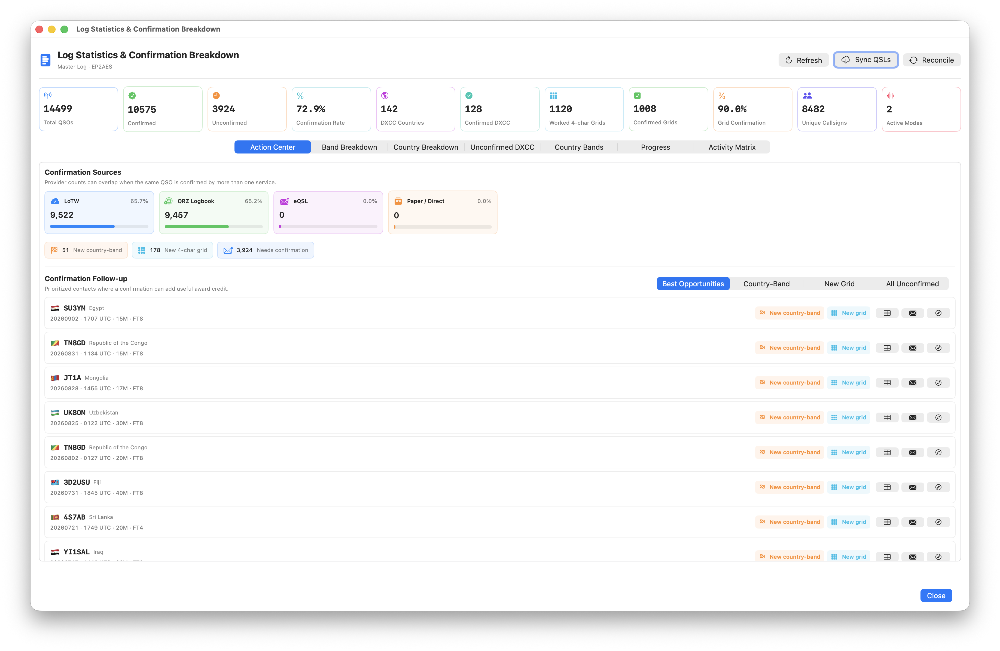

<div align="center">
  
  <h1>YAAM</h1>
  <p><strong>Yet Another ADIF Manager</strong></p>
  <p>A native macOS logbook and operating desk for amateur radio.</p>

  <p>
    <a href="#features">Features</a> ·
    <a href="#operator-desk">Operator Desk</a> ·
    <a href="#build-from-source">Build from source</a> ·
    <a href="#documentation">Documentation</a> ·
    <a href="USER_MANUAL_FA.md">راهنمای فارسی</a>
  </p>

  <a href="#build-from-source"></a>
  <a href="#under-the-hood"></a>
  <a href="#features"></a>
  <a href="LICENSE"></a>
</div>

<br>

**Log contacts. Find your next DX. Keep track of every confirmation.**

YAAM brings your logbook, DX activity, radio controls, contests, and QSL workflows into one Mac app. Use it to organize ADIF logs, explore worked countries and grids, follow award opportunities, and move from a spot to a contact without switching between separate tools.

## A look inside

<p align="center">
  
  <br>
  <em>Globe &amp; Grids — see your contacts, grids, and great-circle paths on the map.</em>
</p>

<details>
<summary><strong>View the statistics and confirmation dashboard</strong></summary>

<br>



**Turn your log into a plan.** Review confirmation sources, country-band coverage, grid progress, and contacts worth following up on.

</details>

<sub>Screenshots come from the bundled user guide. Controls and layout may differ between releases.</sub>

## Features

| | What you can do |
| :--- | :--- |
| **📒 Logbook** | Import and export ADIF, search and filter contacts, manage station profiles, and edit records in bulk. |
| **🌍 DX activity** | Follow cluster spots, inspect the Bandmap, explore countries and grids, and monitor callsigns and band openings. |
| **📻 Radio & digital** | Connect through Hamlib, FLRig, or TCI; operate the built-in FT8 station and work with multiple receivers. |
| **🏆 Awards & statistics** | Track DXCC, WAS, and grids; compare worked and confirmed totals; find contacts that can add award credit. |
| **✉️ QSL & outreach** | Work with LoTW, QRZ, eQSL, and Club Log; prepare labels and cards; compose follow-up messages from saved templates. |
| **📻 SKED directory** | Browse the top 19 ranked operators in a country with names and available emails; copy addresses, prepare SKED mail, or export CSV. |
| **⚡ Contest & CW** | Use contest exchanges, serials, ESM, and Cabrillo export alongside keyer tools, CW training, and pileup practice. |

### Built for the operating desk

- **Quick Log:** callsign lookup, worked history, keyboard shortcuts, and contest exchanges in one form.
- **Bandmap Studio:** a frequency ruler, spectrum and waterfall views, spot filters, and a station inspector.
- **Confirmation opportunities:** identify unconfirmed contacts that could add a country, band, or grid credit.
- **Multiple station profiles:** keep home, portable, rover, club, and contest setups organized.
- **Flexible window layouts:** controls wrap and panels adapt as the available space changes.

<details>
<summary><strong>Explore more capabilities</strong></summary>

### Log management

Search across callsigns, names, QTH, states, counties, grids, and notes. Combine band, mode, DXCC, continent, date, and confirmation filters. Import ADIF and supported radio-software logs, review duplicates, and bulk edit or export selected contacts.

### QSL workflows

Use LoTW signing through TQSL, QRZ logbook synchronization, eQSL and Club Log integrations, and the QSL card and label tools. Service accounts, credentials, and external tools may be required for individual integrations.

### Operator outreach

Save reusable email templates with filter criteria and tags such as `{CALL}`, `{NAME}`, `{BAND}`, and `{DATE}`. Use SMTP dispatch controls to set message delays and stop a batch when needed.

### Rank and award tracking

Review QRZ ranking history and tracked competitors, country-by-band coverage, and worked or confirmed award progress. Use confirmation opportunities to prioritize useful follow-ups.

### Radio and digital modes

Connect radio services through Hamlib `rigctld`, FLRig, or TCI. The built-in FT8/FT4 modem uses the `ft8-808` engine; additional workspaces support multi-rig reception, rotator control, and digital operating tools.

### Practice and simulation

Use CW training, audio decoding, pileup practice, and WinKeyer tools. The network transceiver emulator provides Icom-style network radio simulation for development and demonstrations without physical radio hardware.

</details>

## Operator Desk

Six groups organize the tools around the way you operate. **All tools** lets you search for a destination by name, mode, or task.

| Workspace | Tools and workflows |
| :--- | :--- |
| **Operating** | Quick Log, Shack Clock, portable and rover operations |
| **DX Activity** | DX Cluster, Club Log Spots, Bandmap, Call Roster, Digital Callsign Monitor, Globe & Grids, Signal Footprint, 6m Watch, DX News, ON4KST |
| **Radio & Digital** | Radio Bridge, FLRig, rotator control, FT8, multi-rig FT8, Digital Suite, TCI, transceiver emulator |
| **CW Workstation** | Keyer, CW Academy, reference tools, audio decoder, pileup simulator, hardware diagnostics |
| **Contest & Awards** | Contest sessions, calendar, awards, club memberships |
| **QSL & Data** | QSL Hub, card and label design, log sources, cloud companion |

## Build from source

### Requirements

- **macOS 15.6 or later**, matching the app target's deployment setting.
- A recent **Xcode** with Command Line Tools and support for the project's Swift package dependencies.
- **Optional:** [ARRL TQSL](https://www.arrl.org/tqsl-download) for LoTW signing and upload.

### Clone and build

```bash
git clone https://github.com/fact0real/yaam.git
cd yaam
open YAAM.xcodeproj
```

Build the Release app from Terminal:

```bash
xcodebuild -project YAAM.xcodeproj \
           -scheme YAAM \
           -configuration Release \
           -derivedDataPath build/DerivedData \
           build
```

The app bundle is created at `build/DerivedData/Build/Products/Release/YAAM.app`.

<details>
<summary><strong>Sign and install a local build</strong></summary>

For a local build, sign with the project's sandbox entitlements:

```bash
codesign --force --deep --sign - \
         --entitlements YAAM/YAAM.entitlements \
         build/DerivedData/Build/Products/Release/YAAM.app
```

Quit YAAM before replacing an existing installation. Copy the built app to `/Applications`:

```bash
ditto build/DerivedData/Build/Products/Release/YAAM.app /Applications/YAAM.app
codesign --verify --deep --strict /Applications/YAAM.app
```

</details>

## Documentation

| Guide | Start here for… |
| :--- | :--- |
| [English user manual](USER_MANUAL.md) | Station setup, logging, QSL services, radio tools, and day-to-day operation |
| [راهنمای کاربری فارسی](USER_MANUAL_FA.md) | راه‌اندازی ایستگاه، ثبت تماس‌ها، سرویس‌های QSL و ابزارهای رادیویی |
| [Developer documentation](DEVELOPER_DOCUMENTATION.md) | Application architecture, modules, storage, networking, and implementation details |
| [App icon assets](Design/AppIcon/README.md) | Production artwork, icon sizes, and asset-catalog maintenance |

## Under the hood

YAAM uses **Swift and SwiftUI**, **SQLite with WAL**, and Apple's **AVAudioEngine**, **Accelerate**, **Network**, and **CryptoKit** frameworks. Swift concurrency supports background work across log processing, service integrations, and radio workflows.

## Your data and connected services

Logbooks and station data are stored locally. Credentials are encrypted using the app's hardware-bound vault. Connected features exchange data with the services you configure; some monitoring and synchronization features can run in the background when enabled. Local logbook work remains available without those services.

## License & credits

Developed by **EP2AES** for the amateur radio community. Licensed under the **[GNU General Public License, version 3](LICENSE)**.

<p align="center"><sub>73 — see you on the bands.</sub></p>
